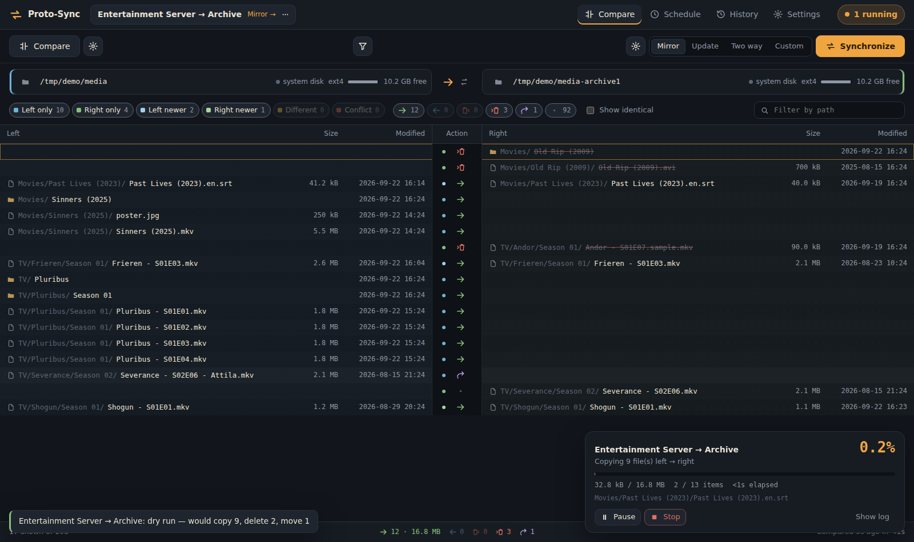
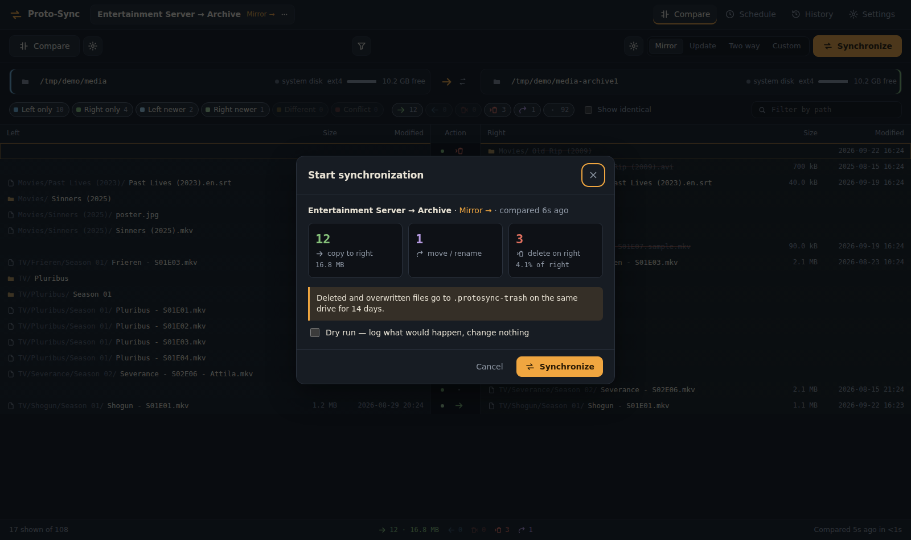
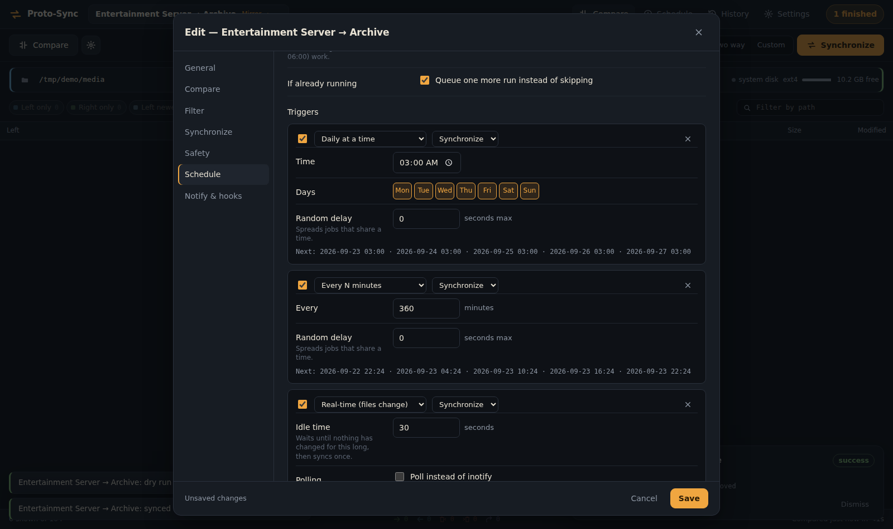
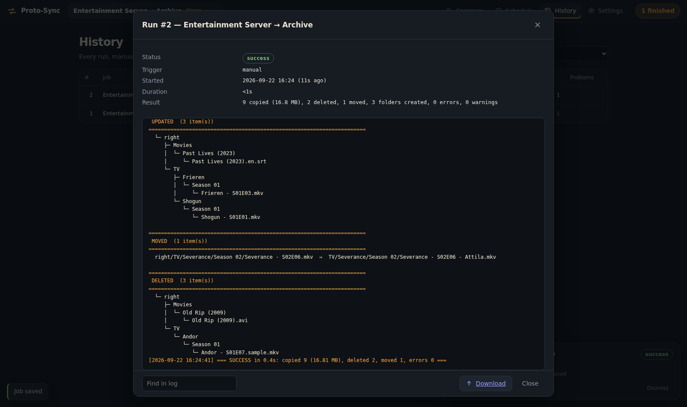

<div align="center">



*Compare two drives, see every change before it happens, then sync... by hand, on a schedule, or the moment a drive plugs in.*

</div>

---

## Screenshots

<div align="center">

| | |
|:-:|:-:|
|  |  |
|  |  |

</div>

---

## What it does

Proto-Sync is a self-hosted, FreeFileSync-style backup tool that lives in your browser.
Point it at two folders, and it shows you side by side exactly what will be copied, updated,
moved, and deleted. Nothing changes until you press **Synchronize**. It runs as a
single container, and keeps its history in one SQLite file.

## Features

| | |
|---|---|
| 🔍 **Compare** | Compare by time and size (with a tolerance for NTFS/exFAT timestamps), by file content, or by size alone. Every difference is sorted into left only, right only, left newer, right newer, different, or conflict. |
| 🗂️ **Review grid** | A side-by-side grid that stays fast with hundreds of thousands of files. Filter by category or action, search by path, multi-select, and change what happens to any file or whole folder before you sync. |
| 🔁 **Sync variants** | **Mirror** makes the right an exact copy of the left. **Update** only copies new and newer files. **Two way** remembers the last sync, so it can tell a deletion from a new file. **Custom** lets you pick the action for every category. |
| ↪️ **Moves & renames** | A renamed or moved file is applied as a rename instead of copy + delete. Detection uses size, time, and a sampled content hash, so two different files that happen to match on name and size are never confused. |
| ♻️ **Recycle & versioning** | Deleted and overwritten files go to a hidden recycle folder on the same drive, cleared after 14 days. Or keep a full time-stamped version history in a separate folder, or delete permanently. |
| 🛡️ **Safety guards** | Refuses to run against an empty mountpoint, an empty source, or a sync that would delete too much. Checks free space, watches both drives mid-run, re-checks each file before deleting it, and verifies every copy. |
| ⏰ **Scheduling** | Daily at a time, every N minutes, cron, once, on startup, or after another job finishes. Add as many triggers as you like, with an allowed-hours window. The editor previews the next five run times. |
| ⚡ **Real-time** | Watch a folder and sync a few seconds after things stop changing. Polling mode covers network shares and FUSE mounts where file watching doesn't work. |
| 🔌 **Drive connects** | Plug in the archive drive and it backs itself up. |
| 📊 **Live progress** | Percent, speed, ETA, and the current file, with pause, resume, and stop. |
| 📜 **History** | Every run is kept with its trigger, result, and a full log, including trees of everything created, updated, moved, and deleted. |
| 🔔 **Notifications** | ntfy, Discord, Gotify, email, or a JSON webhook, on every run, only on changes, or only when something goes wrong. |
| 🔗 **Webhooks & hooks** | Every job gets its own start URL for scripts, Home Assistant, or other machines. Run your own shell commands before and after a sync. |
| 🔑 **API** | Everything in the UI is available over a REST API, plus a live event stream. |

---

## Quick start

```bash
git clone https://github.com/FrameEnder/Proto-Sync.git
cd Proto-Sync
cp .env.example .env        # set PROTOSYNC_ROOTS, TZ, and your two folders
podman compose up -d --build
```

Go to **http://localhost:8475**. On first start, Proto-Sync creates a job for the two folders
in `.env` (`/mnt/media` → `/mnt/media-archive1` by default). Its daily trigger starts turned off.

Docker works too: use `docker compose` instead, and see the `user:` note in `compose.yaml`.

---

## Run as a service

The recommended way on a server is a rootless Podman **Quadlet**. systemd starts it at boot
and restarts it if it stops:

```bash
podman build --format docker -t localhost/proto-sync:latest .
mkdir -p ~/.config/containers/systemd ~/.local/share/proto-sync
cp deploy/proto-sync.container ~/.config/containers/systemd/
systemctl --user daemon-reload
systemctl --user start proto-sync
loginctl enable-linger $USER   # keep it running while you're logged out
```

Edit the paths and `TZ` in `proto-sync.container` first. Logs: `journalctl --user -u proto-sync -f`

These are mounted into the container:

| Mount | What it's for |
|---|---|
| `/data` | the SQLite database, run logs, and locks |
| `/mnt` → `/mnt` (`rslave`) | your drives, at the same path inside as outside |

A few of the mount options matter:

- **`rslave`** lets a drive that's mounted *after* the container started show up inside it.
  Without it, the "drive connects" trigger never fires.
- **`SecurityLabelDisable`** is for SELinux hosts (Fedora, Bazzite). The usual `:z` would relabel every file on your drives.
- **No `keep-id`.** Under rootless Podman the container's root already *is* your user, so copied files stay yours.

No containers? `deploy/proto-sync.service` runs it straight on the host with Python 3.11+ and rsync.

---

## First sync

1. Make sure both drives have a sentinel file. This is how Proto-Sync tells a mounted drive from an empty folder:
   ```bash
   touch /mnt/media/.mounted /mnt/media-archive1/.mounted
   ```
   You can also click the red **no .mounted** badge next to a path, but only when the drive really is mounted.
2. Press **Compare** (F5) and look over the preview.
3. Press **Synchronize** (F9). Tick **Dry run** the first time to see the plan without changing anything.
4. When you're happy, open **Edit job → Schedule** and turn on a trigger.

---

## Coming from media-backup.sh

Proto-Sync keeps everything the original script did:

| media-backup.sh | Proto-Sync |
|---|---|
| `SRC` / `DST` | left and right of a folder pair |
| rsync `--delete-after` | **Mirror**, with deletion timing *After copying* |
| `.mounted` sentinel checks | Safety → Sentinel file, required on both sides |
| empty-source guard | Safety → Empty source guard |
| `flock` lock file | per-drive locks, so two jobs never touch the same drive at once |
| `--no-perms --no-owner --no-group` | applied automatically on NTFS, exFAT, FAT, and CIFS |
| `--modify-window=2` | Compare → Time tolerance: 2 s |
| `EXCLUDES=(…)` | Filter → Exclude (**Reset to media-backup defaults** restores the list) |
| `--dry-run` | the **Dry run** checkbox, or a trigger set to *Dry run only* |
| `--verify` | Sync → Verify copies |
| the progress2 line | the run panel |
| the change tree in the log | the same trees in every run log |
| 30-day log retention | Settings → Keep run history |

**One deliberate difference:** the script deleted files permanently. Proto-Sync moves them
to `.protosync-trash` on the same drive for 14 days instead, which is your undo for a bad mirror.
Set Sync → **Delete permanently** if you want the old behavior.

---

## Safety

A run that trips a guard is **blocked**. Nothing is changed, and the log and notification say why.

| Guard | What it does |
|---|---|
| **Sentinel & mountpoint** | refuses to sync against a drive that isn't attached |
| **Empty source** | refuses to mirror an empty left side over a full right side |
| **Max deletions** | blocks a sync that would delete more than 50% (adjustable). After reviewing, you can override it for that one run. Scheduled runs are never overridden. |
| **Free space** | checks the target can hold what's about to be copied |
| **Drive watch** | stops the run if a drive disappears or stops responding mid-transfer |
| **Re-check before delete** | a file that changed since the comparison is skipped, not deleted |
| **Verify** | every copy is checked for size and time, optionally by checksum, and flushed to disk |

---

## Configuration

Everything is set with environment variables in `.env` (or `Environment=` lines in the Quadlet unit):

| Variable | Default | What it's for |
|---|---|---|
| `PROTOSYNC_ROOTS` | `/mnt,/media,/srv,/run/media` | Only folders under these can be browsed or synced. |
| `PROTOSYNC_PORT` | `8475` | The port the web UI listens on. |
| `PROTOSYNC_USER` / `PROTOSYNC_PASSWORD` | *(empty)* | Turns on a login when both are set. |
| `PROTOSYNC_MAX_RUNS` | `1` | How many syncs can run at once. The rest wait in line. |
| `PROTOSYNC_SEED_LEFT` / `_RIGHT` | `/mnt/media`, `/mnt/media-archive1` | The folders for the job created on first start. |
| `PROTOSYNC_DATA` | `/data` | Where the database and logs live. |
| `TZ` | `UTC` | The time zone schedules use. |

Size units and how long run history is kept are set inside the app on the **Settings** page.
Sizes default to decimal (1 GB = 1,000,000,000 bytes), the same as FreeFileSync and drive labels.

---

## API

Every job has its own start URL under **Edit job → Schedule**. It works even when the login
is turned on, because the token in the URL is the key. **Rotate** makes the old URL stop working.

```bash
curl -fsS -X POST 'http://your-host:8475/api/hooks/<job-id>?token=<token>'
curl -fsS -X POST 'http://your-host:8475/api/hooks/<job-id>?token=<token>&dry_run=true'
```

Main endpoints:

| Method | Endpoint | Notes |
|---|---|---|
| `GET` | `/api/jobs` | list jobs with their last and next run |
| `POST` | `/api/jobs/{id}/compare` | start a comparison |
| `POST` | `/api/jobs/{id}/run` | compare and sync in one go (`{"dry_run": true}` for a preview) |
| `GET` | `/api/runs` | run history |
| `GET` | `/api/runs/{id}/log` | a run's full log |
| `POST` | `/api/runs/{id}/pause` · `/resume` · `/cancel` | control a running sync |
| `GET` / `POST` | `/api/hooks/{id}?token=…` | the per-job start URL |
| `GET` | `/api/events` | live events (progress, results) as a server-sent stream |
| `GET` | `/api/health` | health check |

---

## Keyboard

| Key | Does |
|---|---|
| `F5` / `F9` | compare / synchronize |
| `/` | search the comparison |
| `↑` `↓` `PgUp` `PgDn` `Home` `End` | move through the grid (`Shift` extends the selection) |
| `Ctrl+A` / `Esc` | select all / clear the selection |
| `Alt+→` / `Alt+←` | copy to the right / copy to the left |
| `Alt+0` / `Alt+D` | do nothing / back to the default action |
| `Shift+F10` | context menu |

---

## How it's built

```
app/
  main.py          the FastAPI app: REST API, live events, login
  compare.py       scanning results into categories, move detection, two-way logic
  scanner.py       the folder walker and filter patterns
  syncer.py        runs a sync: rsync, moves, deletions, versioning, verification, logs
  runner.py        the run queue, drive locks, pause and cancel
  scheduler.py     triggers: times, cron, real-time watching, drive connects
  notify.py        ntfy, Discord, Gotify, email, webhooks, and shell hooks
  fsutil.py        mounts, free space, the folder browser
  db.py            the SQLite data layer
  models.py        the job settings
static/
  index.html       the page shell
  js/              the frontend (plain JavaScript modules, no build step)
  css/app.css      the dark theme
deploy/            the Podman Quadlet unit and a bare-metal systemd unit
meta/              the banner and screenshots for this README
```

The engine underneath is plain rsync, so there's nothing proprietary between you and your files.
Everything Proto-Sync knows lives in one SQLite file in your data folder.

---

## Updating

```bash
git pull
podman build --format docker -t localhost/proto-sync:latest .
systemctl --user restart proto-sync
```

Your jobs and history are kept. The version number is shown under **Settings**.

---

## Troubleshooting

| Problem | Fix |
|---|---|
| A drive shows as missing but it's mounted on the host | The `/mnt` bind is missing `rslave`, or the drive is mounted outside the bound folder. |
| Runs are blocked with "no .mounted" | Create the sentinel file on that drive, but only if it really is mounted. |
| Every file shows as different on NTFS or exFAT | Keep the time tolerance at 2 s. If the drive changed time zones, add `1` to *Ignore time shift*. |
| The real-time trigger says the watch failed | Raise `fs.inotify.max_user_watches` (e.g. `524288`), or tick *Poll instead of inotify*. |
| Permission denied on copies | Under rootless Podman your user must be able to write to the drive. Under Docker, see `user:` in `compose.yaml`. |
| The UI looks the same after updating | Reload once with the browser cache disabled. Newer versions re-check files automatically. |
| Fonts look plain | The fonts load from Google Fonts in your browser. Offline it falls back to system fonts. |

---

<div align="center">

**Proto-Sync** · see every change before it happens.

</div>
